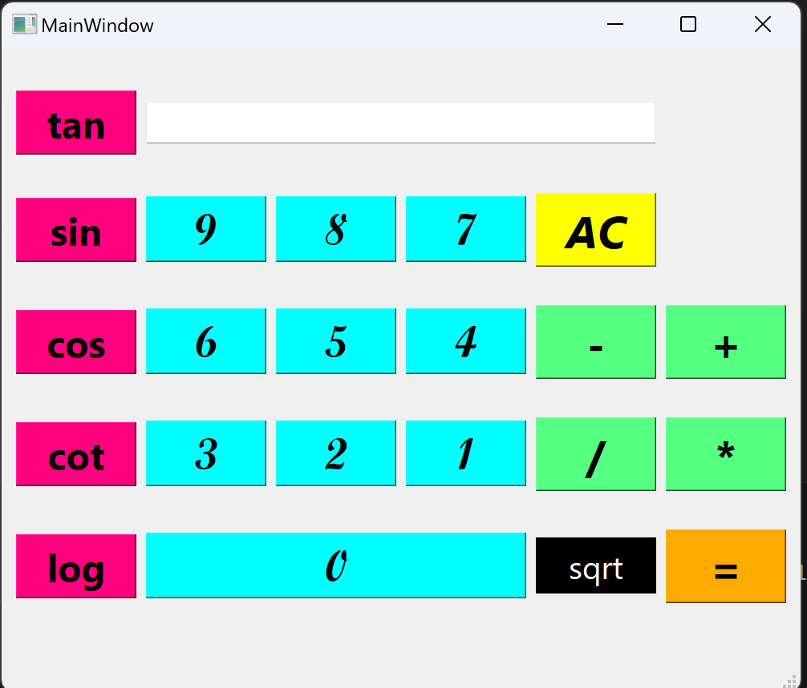
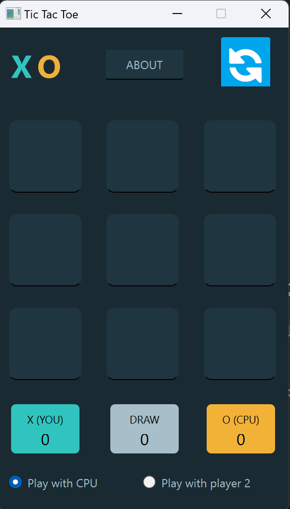

># Assignment_18

## Files Description

| File name | Description |
|--- | --- |
|Calculator.py | simple calculator program |
|Tic_Tac_Toe.py | Tic Tac Toe game with GUI with a little intelligence|

># Calculator with Pyside6(Qt)
This is a calculator that writed in python 
And it can calculate the four basic operations as well as operators such as sine and cosine.
There is also a clear button at the top to clear the text box.

---

>## How to Run
execute this command in terminal:
python main.py

>## Results

The face of calculator is shown below:

# Output:

># TicTacToe Game with Pyside6(Qt)
Tic Tac Toe is a simple game for two players. The first player who can quickly fill a row or a column or diagonally a 3 x 3 square wins the game. If all the cells of the table are filled and no one succeeds in completing the mentioned conditions, the game will be tied.

>## How to Play?
First Select the mode of playing between: 
    
     1. Player vs CPU (play with computer)
     2. Player1 vs Player2 (play with another one)

In each turn players have to select an empty cell.
when you play with computer: After your turn computer select one cell
when you play with another one: After your turn he/she can select an empty cell.

>## How to win?
Whoever can first place their mark in three cells next to each other vertically, horizontally or diagonally, wins.

>## Note
you can click on 🔄️New game🔄️ button and start a new game!
if you change the mode of game then game will be restarted and you have to start again.

# Output:

